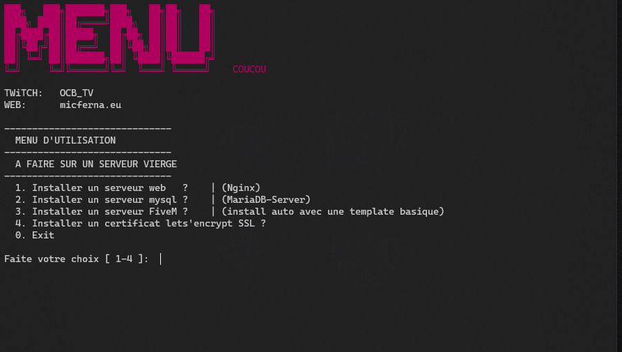

# Menu auto install Fivem *Debian 11*

### Le menu installe & pré configure un serveur FiveM (chaque option est individuelle.)
Un serveur web (nginx) depuis les dépôts officiels    
Un serveur Mariadb-server (depuis les dépôts).  
Un serveur FiveM avec une template basique .  

#### Comment utiliser le menu ?
```
apt install git
git clone https://github.com/micferna/fivem_setup
cd fivem_setup
bash menu.sh  

Puis faites les options 1,2,3,4 selon ce que vous voulez installez.
```


Le répertoire du jeu est situé dans  `/mnt/gta` Placez votre serveur de jeux à la fin de l'installation dans le dossier `/mnt/gta/server-data` pour ne pas tout péter :D


### Pour ceux qui on installé FiveM depuis le menu  
Dans la console shell tapez ces trois lignes
```
echo "alias fivem='sh /mnt/gta/manage.sh'" >> ~/.bashrc
chmod +x /mnt/gta/manage.sh
source ~/.bashrc
```

#### Un cron pour restart automatiquement le serveur a des heures précises
Pour rajouter un crontab `crontab -e` puis rajouter ces lignes.
```
00 00 * * * /mnt/gta/manage.sh restart
0 12 * * * /mnt/gta/manage.sh restart
0 18 * * * /mnt/gta/manage.sh restart
```
Les heures préconfigurées
> 00:00
> 12h00
> 18h00  
PS: N'oubliez pas de modifier le timer dans le fichier `/mnt/manage.sh`  
si vous voulez mettre moins de temps pour reboot le serveur par defaut 3 minutes avant la coupure.  
>
> #### Dès à présent, il y a de nouvelles commandes disponibles pour gérer le serveur plus facilement depuis le Shell.
>
> - fivem start
> - fivem status
> - fivem restart
> - fivem update 
> - fivem screen # Pour rentrer dans la console du serveur
>
> *enjoy* 

#### EN COURS :  
fivem update  
let's encrypt
